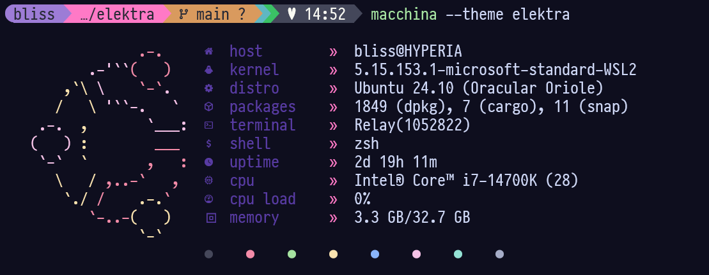

# ⚡ elektra

A vibrant theme for [Macchina](https://github.com/Macchina-CLI/macchina), designed for a sleek and informative system information display.



## 🌟 Features

- 🎨 Vivid accent colors for enhanced readability
- 🔮 Custom Ubuntu-inspired ASCII art
- 🌈 Colorful palette display
- 🔤 Unique separators and glyphs
- 💻 Optimized for style and clarity

## 🛠️ Installation

1. Ensure you have Macchina installed. If not, follow the [official installation guide](https://github.com/Macchina-CLI/macchina/wiki/Installation).

2. Clone this repository:
   ```
   git clone https://github.com/hyperb1iss/elektra.git
   ```

3. Copy the `elektra.toml` file to your Macchina themes directory:
   ```
   cp elektra.toml ~/.config/macchina/themes/
   ```

4. Copy the `ubuntu-ascii.txt` file to your desired location and update the path in `elektra.toml` if necessary.

## ⚡ Usage

To use the elektra theme, run Macchina with the `--theme` flag:

```
macchina --theme elektra
```

## 🎛️ Customization

Feel free to modify the `elektra.toml` file to suit your preferences. You can adjust colors, glyphs, and other visual elements. Refer to the [Macchina theming documentation](https://github.com/Macchina-CLI/macchina/wiki/Customization) for detailed information on customization options.

## 🚀 Screenshot Setup

The screenshot demonstrates elektra on my main dev system with the following setup:

- **Theme**: Windows Terminal is using the [Catppuccin](https://github.com/catppuccin/windows-terminal) color palette, known for its warm and cozy feel.
- **Prompt**: The prompt shown uses [Starship](https://starship.rs/) with a modified version of the Pastel Powerline preset (available in my dotfiles repo).
- **Font**: My preferred console and coding font is [Pragmata Pro](https://fsd.it/shop/fonts/pragmatapro), a gorgeous monospace font 💜  It comes with the Nerd Fonts glyphs and is absolutely worth the cost, especially if you spend a lot of time in an IDE or terminal! 
- **System**: My gorgeous Hyperia dev machine where I spend a lot of my time! It's packed with RGB and has an amazing audio setup for music production. My WSL2 Linux environment is where most of my development happens.

Note that these are not part of the elektra theme itself but showcase how it can look in a customized environment.

## 🤝 Contributing

Contributions are welcome! If you have ideas for improvements or find any issues, please open an issue or submit a pull request.

## 📜 License

This project is licensed under the MIT License - see the [LICENSE](LICENSE) file for details.

## 🙌 Acknowledgments

- Inspired by the Macchina project and its community
- Ubuntu ASCII art adapted for use in this theme
- Ideas from [astatine](https://github.com/espeon/astatine)

---

<div align="center">

Created by [Stefanie Jane 🌠](https://github.com/hyperb1iss)

If you find this project useful, [buy me a Monster Ultra Violet](https://ko-fi.com/hyperb1iss)! ⚡️

</div>